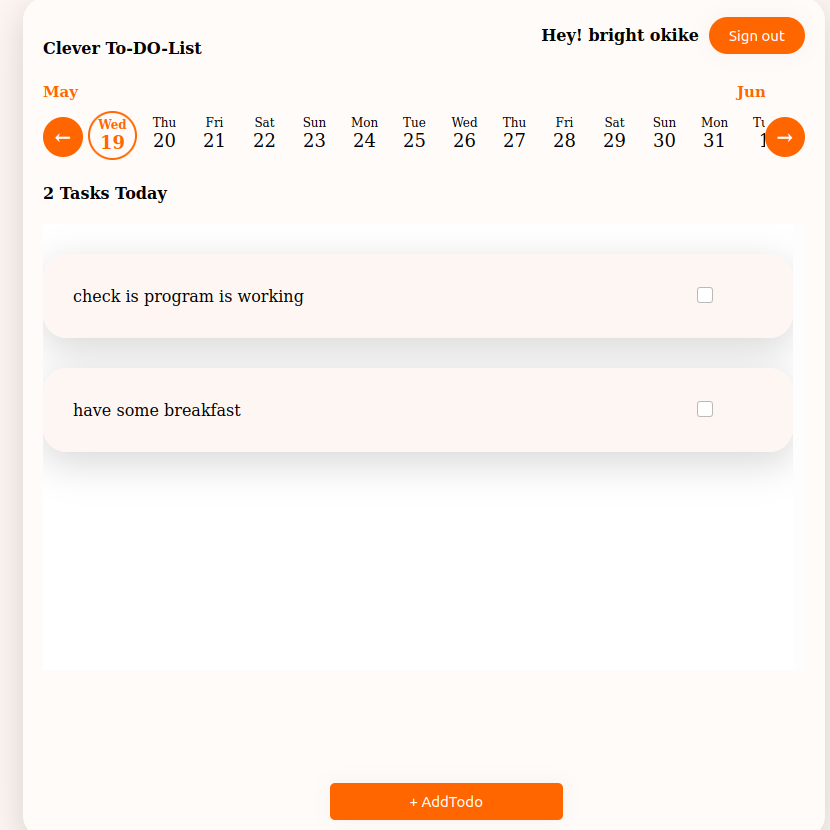

<h1 align=center> **CLEVER TO-DO LIST** </h1>

[](https://github.com/RichardLitt/standard-readme)
[](https://david-dm.org/dwyl/esta)

In this project i built a todo list using firebase for user authentication and data storage. user can not have access to the app if not authenticated. A user can view his or her todo list for each day starting from the current date. 
User can be able to create, edit and delete todo created by him/her




## Background

- React
- React-DOM
- React-Create-App
- TypeScript
- JavaScript
- npm
- SCSS
- FIREBASE

## Demo
The demo page can be found [HERE](https://clever-to-do-list.netlify.app/)

## Usage

> Clone the repository to your local machine

```sh
$ git clone https://github.com/macbright/clever-todo-list-ts.git
```

> cd into the directory

```sh
$ cd clever-to-to-list
```

> install the npm packages

```sh
$ npm install
```

> create a firebase account, create a project and setup a web app. 

> create a .env file in your root folder and paste your firebase configuaration settings. save the variables according to how they are called in the base.js file.

> use npm or yarn to start the server (note: you must have npm and yarn install)

```sh
$ yarn start
```
OR

```sh
$ npm start
```
this runs the app in the development mode.<br />
Open [http://localhost:3000](http://localhost:3000) to view it in the browser.


## Maintainer

👤  **Bright Okike**

- Github: [@macbright](https://github.com/macbright)
- LinkedIn: [@bokike](https://www.linkedin.com/in/bokike/)
- Twitter: [@b_okike](https://twitter.com/b_okike)
  

## Future Features
1. implement notification functionalities to send daily and hourly notification to users


## Contributing

1. Fork it (https://github.com/macbright/clever-todo-list-ts.git)
2. Create your feature branch (git checkout -b feature/[choose-a-name])
3. Commit your changes (git commit -am 'What this commit will fix/add')
4. Push to the branch (git push origin feature/[chosen name])
5. Create a new Pull Request

## License

Bright okike 
[MIT license](https://opensource.org/licenses/MIT).